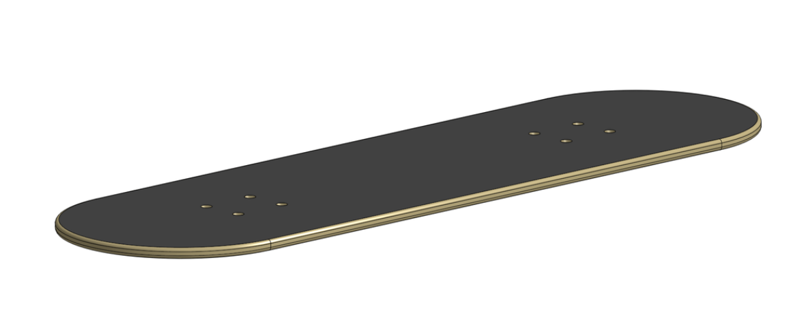
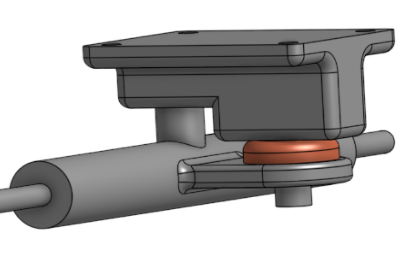
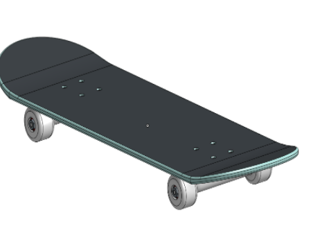
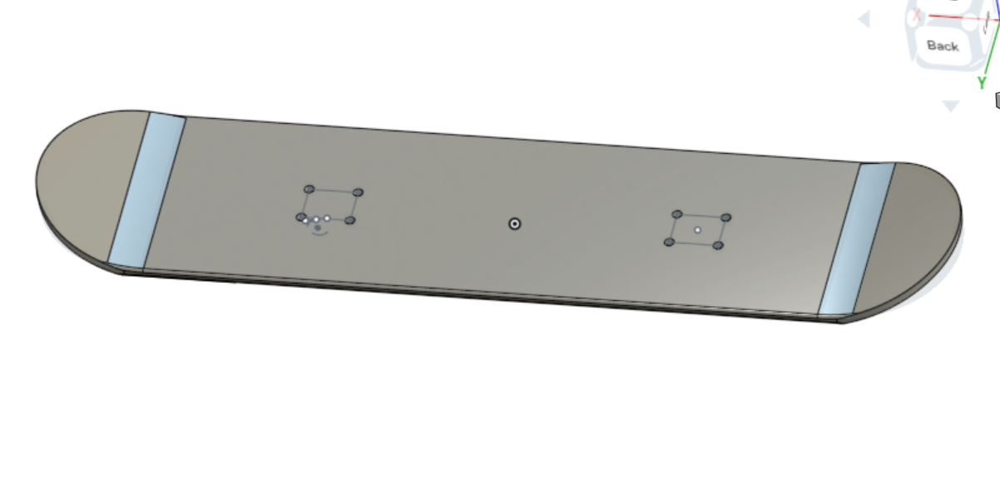

# Cad skateboard

For this assignment in cad, I had to create a skateboard. The skateboard consisted of many different parts that had to be put together in the end. After I assembled, I went back into a few sketches and fixed them while also bending the board.
## Skateboard

### Table of Contents

* [Deck](#Deck)
* [Trucks](#Trucks)
* [Wheels_and_Bearings](#Wheels_and_Bearings)
* [Assembly](#Assembly)
* [Bending_the_board](#Bending_the_board)

### Deck
The deck was the simplest part. I created a rectangle and 2 circles on it. I created a few contraits like tangent and extruded the deck. I also had to cut holes in the deck. THis was eas as all I had to do was create a rectangle, cut 4 circles and refect it.

### Trucks
The trucks were a difficult component of the skateboard. For this I had to be precise and draw all of the right lines in the right places. I drew some rectangles, extruded them, and created fillets. For the axle, I created a rod that was concentric to a hollowed out rod. This holds the wheels. Lastly, I combined the components of the truck.

### Wheels and Bearings
The wheels and bearings were realativly easy. I drew to rectangles, then created a revolute extrusionion. This created the wheel. Next I made a few indents in the wheel and that was done. THen I had to do the bearing which was just an extruded circle with a hole and a fillet on one side.

### Assembly
The assembly was a hard process for me. It took me a lot of time. I had to mate using fasten mates. First I mated the deck to the trucks. Then I added the wheels to the axle using revolute mates. Lastly I had to add screws into the holes. This process was hard at first, but I kept trying and figuired it out even thogh the srcews were being annoying.

### Bending the board
Bending the board was very straight forward. I had to use a line that started the circular part of the board. I bent that at a 15 degree angle. I added a 6in fillet to the top to round it out. I did this to the other side and was done in 10 minutes.

